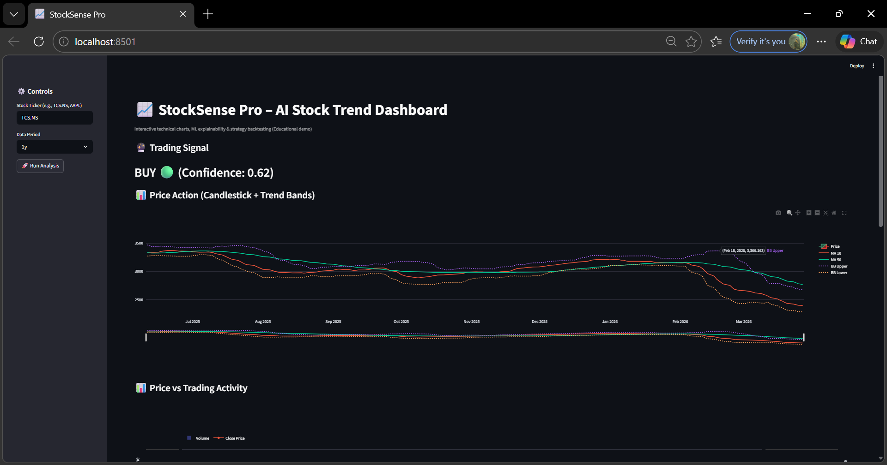
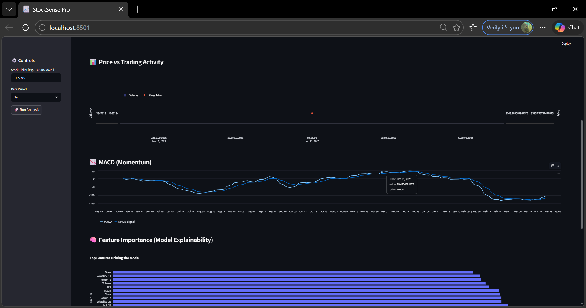
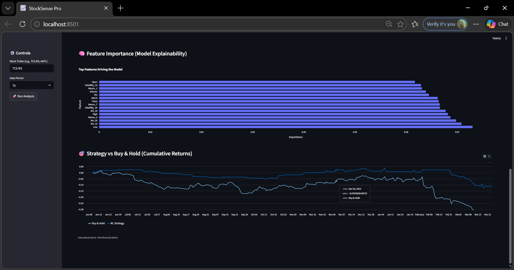
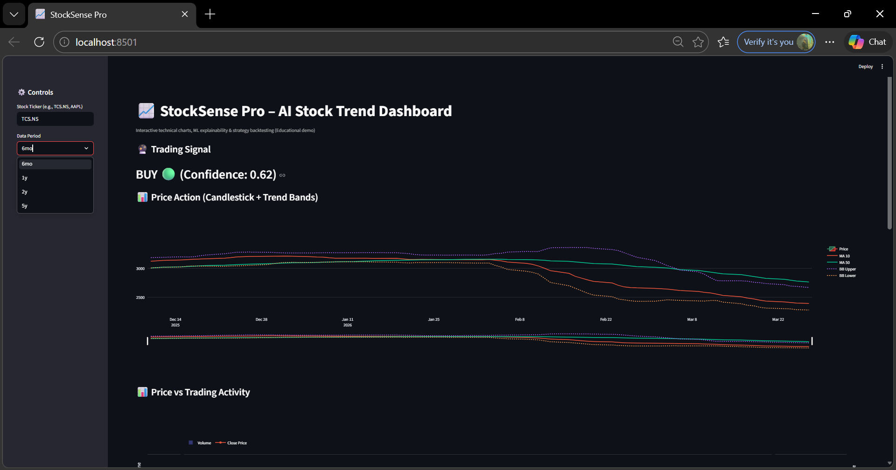
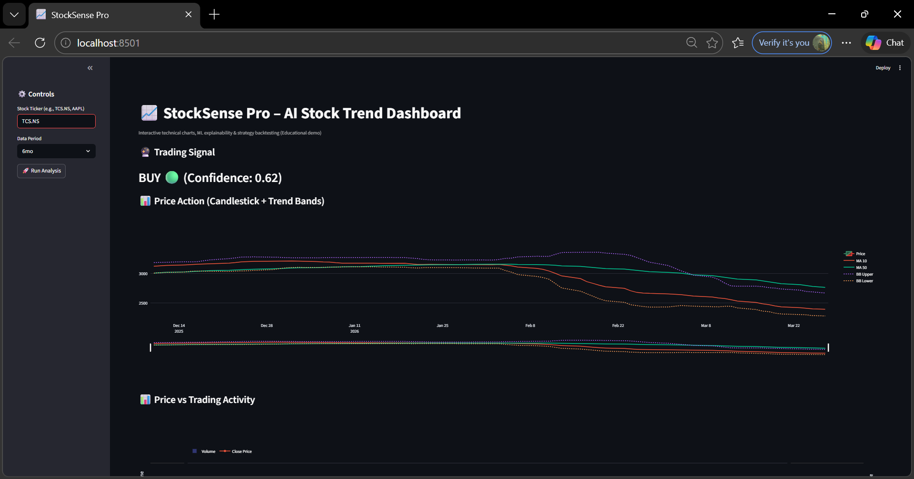

# 📈 StockSense Pro – AI Stock Trend Dashboard

## 🚀 Overview

StockSense Pro is an end-to-end Machine Learning + FinTech dashboard that predicts short-term stock price direction and generates actionable trading signals (BUY / SELL / HOLD).

This project covers the **complete ML lifecycle**:

* 📊 Data Collection
* 🔧 Feature Engineering
* 🤖 Model Training & Comparison
* 🎯 Threshold Optimization
* 📉 Evaluation (Confusion Matrix)
* 🖥️ Deployment using Streamlit

⚠️ **Disclaimer:** This project is for educational purposes only and not financial advice.

---

## 🎯 Problem Statement

Predict whether the **next-day stock price will go UP or DOWN** using historical market data and technical indicators.

---

## 🔄 End-to-End Pipeline

```text
Import → Data Download → Feature Engineering → Target Creation →
Feature Selection → Train/Test Split → Model Comparison →
Model Selection → Threshold Optimization → Evaluation →
Model Saving → Streamlit UI
```

---

## 📊 Step-by-Step Pipeline Explanation

### 1️⃣ 📦 Import Libraries

* pandas, numpy → data processing
* yfinance → data collection
* sklearn → ML models & evaluation
* xgboost → final model
* matplotlib, seaborn → visualization
* joblib → model saving

---

### 2️⃣ 📥 Data Collection

* Data fetched using **yFinance API**
* Includes:

  * Open, High, Low, Close, Volume

---

### 3️⃣ 🔧 Feature Engineering

#### 📊 Price Data

* Open, High, Low, Close, Volume

#### 📈 Trend Indicators

* MA10, MA20, MA50

#### 📉 Volatility

* 10-day rolling volatility
* 20-day rolling volatility

#### ⚡ Momentum

* RSI (Relative Strength Index)
* MACD (Moving Average Convergence Divergence)

#### 🔁 Returns

* Return_1 (1-day)
* Return_3 (3-day rolling)
* Return_7 (7-day rolling)

---

### 4️⃣ 🎯 Target Engineering

After feature engineering, the target variable was created using future returns.

Instead of using a fixed threshold, multiple threshold ranges were tested to find the optimal value.

🔬 Thresholds Tested
Wide range evaluated:
0.001 → 0.010 (0.1% → 1%)
Each threshold was tested by:
Training models
Comparing Accuracy & Balanced Accuracy
Evaluating prediction stability
🏆 Final Target Threshold

✅ 0.004 (0.4%) selected as optimal threshold

📌 Target Definition
If Return > 0.004 → 1 (UP)
Else → 0 (DOWN)
📊 Target Distribution
Target distribution was visualized to:
Check class imbalance
Ensure proper UP/DOWN balance
Validate quality of labeling
💡 Benefits
Reduces noise from very small price movements
Avoids overly strict classification
Improves model stability
Leads to better Balanced Accuracy

---

### 5️⃣ 📌 Feature Selection

Final features used:

* Open, High, Low, Close, Volume
* MA10, MA20, MA50
* Volatility_10, Volatility_20
* RSI, MACD
* Return_1, Return_3, Return_7

---

### 6️⃣ 🔀 Train-Test Split

* Data split into training and testing sets
* Ensures model generalization

---

### 7️⃣ 🤖 Models Dictionary

Multiple models compared:

* Logistic Regression
* Random Forest
* SVM
* KNN
* XGBoost

---

### 8️⃣ 🧪 Train & Compare Models

Each model evaluated using:

* Accuracy
* Balanced Accuracy

📊 A final comparison table was created to select the best model.

---

### 🏆 9️⃣ Model Selection

> ✅ **XGBoost selected as final model**

**Why?**

* Highest Balanced Accuracy
* Handles non-linear financial data
* Robust to noise
* Provides feature importance

---

### 🏋️ 🔟 Final Training + Probability Threshold Optimization

After selecting XGBoost:

* Model retrained and optimized
* Probability thresholds tested:

> 🔬 **0.35 → 0.40 range**

Fine-tuning performed:

* 0.36, 0.37, **0.38**, 0.39

---

### 🏆 Final Probability Threshold

> ✅ **0.38 gives best confusion matrix**

**Benefits:**

* Better BUY/SELL balance
* Reduced false signals
* Improved real-world performance

---

### 1️⃣1️⃣ 📉 Confusion Matrix Evaluation

Used to analyze:

* True Positives
* False Positives
* False Negatives

🎯 Goal:

* Reduce wrong BUY signals
* Maintain good UP detection

---

### 1️⃣2️⃣ 💾 Model Saving

```python
joblib.dump(model, "xgboost.pkl")
```

---

### 1️⃣3️⃣ 🖥️ UI Deployment (Streamlit)

* Load saved model
* User inputs:

  * Stock ticker
  * Time period

System performs:

* Data fetching
* Feature engineering
* Prediction

---

### 1️⃣4️⃣ 🔮 Prediction Logic

| Condition             | Signal  |
| --------------------- | ------- |
| Pred = 1 & Prob > 0.6 | 🟢 BUY  |
| Pred = 0 & Prob > 0.6 | 🔴 SELL |
| Otherwise             | 🟡 HOLD |

---

## 📊 Dashboard Features

* 📈 Candlestick Chart + Moving Averages
* 📊 Volume vs Price
* 📉 MACD Indicator
* 🧠 Feature Importance
* 🎯 Strategy vs Buy & Hold

---

## 🖥️ UI Preview

### 📊 Trading Signal Dashboard


### 📈 Price Action


### 📉 Indicators


### 🧠 Feature Importance


### 🎯 Strategy Comparison


---

## 📂 Project Structure

```
├── app.py
├── stock.ipynb
├── xgboost.pkl
├── requirements.txt
├── tickers.txt
├── README.md
└── screenshots/
```

---

## ▶️ How to Run

```bash
pip install -r requirements.txt
streamlit run app.py
```

---

## 📥 Supported Inputs

* 🇮🇳 Stocks → TCS.NS, RELIANCE.NS
* 🇺🇸 Stocks → AAPL, TSLA
* 🪙 Crypto → BTC-USD
* 📊 Index → ^NSEI

---

## 🎯 Key Highlights (Interview Points)

* End-to-end ML pipeline
* Real-time data integration
* Advanced feature engineering
* Model comparison & selection
* **Threshold tuning (0.004 & 0.38)** 🔥
* Confusion matrix optimization
* Explainable ML
* Production-style UI

---

## ⚠️ Limitations

* No news/sentiment analysis
* Market is highly noisy
* Not suitable for real trading

---

## 🚀 Future Improvements

* LSTM / Deep Learning models
* News sentiment analysis
* Portfolio optimization
* Live trading API integration

---

## 💬 Interview Golden Answer

> “I built a complete ML pipeline including feature engineering, model comparison, and threshold optimization. I tuned both target threshold (0.004) and prediction probability (0.38), which improved balanced accuracy and confusion matrix performance, and deployed it using Streamlit.”

---

## ⭐ Final Note

This project demonstrates:

* Real-world ML pipeline design
* Financial domain understanding
* Deployment skills

---
